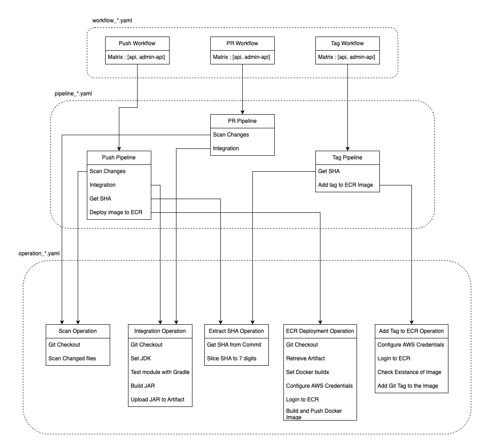

# **현재 파이프라인**

현재 제가 구축한 파이프라인은 `Workflow`, `Pipeline`, `Operation` 3가지의 단계로 나뉘어 있습니다.

## **Workflow**
`Push`, `Create Tag`, `PR Open`으로 `Trigger`되며, 모듈들을 `Matrix`로 관리하고 있어 하위 단계의 `Pipeline`을 모듈별로 나눠 실행합니다.\
변동 가능성이 있는 `Input`, `Secrets`의 대부분을 여기서 관리합니다.

## **Pipeline**
하위 단계의 `Operation`들을 조합하여 모듈을 위한 파이프라인을 구축합니다.\
`Job` 간의 `OUTPUT`들을 조율하여 파이프라인의 전체적인 흐름을 통제합니다.

- Push Pipeline : Push가 발생하면 이를 ECR에 배포합니다.
- PR Pipeline : PR Open이 발생하면 PR 변경사항에 대해 검사합니다.
- Tag Pipeline : Tag가 생성되면 해당 커밋의 ECR 이미지에 태그를 추가합니다.

## **Operation**
가장 세부적인 단계에 속하며, 하나의 `Job`으로 이루어져 있습니다.\
`Job` 내에 여러 개의 `step`으로 구성되어 있으며, 해당하는 작업을 수행하기 위해 여러 과정을 거쳐 지정된 `INPUT`에 맞는 `OUTPUT`을 반환합니다.

- Scan Operation : 커밋의 범위 내에서 해당 모듈의 코드에 변경사항이 있는지 검사합니다.
- Integration Operation : 해당 모듈을 테스트하고, 빌드해서 Artifact로 업로드합니다.
- Extract SHA Operation : 마지막 커밋의 SHA를 추출합니다.
- ECR Deployment Operation : Artifact를 Docker Image로 빌드하여 ECR 레지스트리에 등록합니다.
- Add Tag to ECR Operation : 해당 커밋의 Docker Image가 ECR 레지스트리 내에 존재하면 태그를 추가합니다.

 
 

